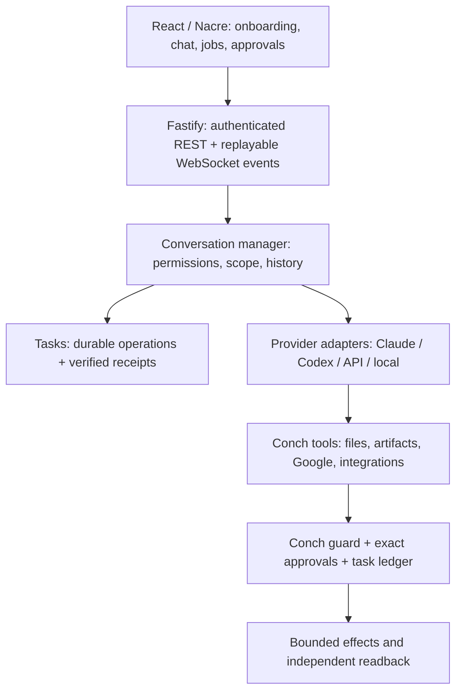

# Architecture

Conch is a **local-first shell around the agents of your choosing**. Out of the box
it drives the Claude Code installation (and its authentication, settings, MCP
servers, hooks and CLAUDE.md files) that already exists on the host machine; it
equally drives another agent on that machine, or a model you hold a key for — all
of them at once. Every connected provider's models are in one picker, and a
conversation can move between them without losing its thread
([ADR 0010](./docs/adr/0010-providers.md), [ADR 0012](./docs/adr/0012-every-provider-at-once.md)).
Apps and skills belong to Conch. Tool-capable models receive the shared
capabilities; chat-only models are identified before a job starts. ChatGPT
subscription access uses Codex app-server device sign-in with Conch-isolated
credentials. See ADRs [0036](./docs/adr/0036-provider-consistency.md),
[0037](./docs/adr/0037-direct-google-accounts.md),
[0038](./docs/adr/0038-durable-verified-tasks.md) and
[0039](./docs/adr/0039-first-useful-result.md).



## Principles

1. **Providers supply reasoning; Conch owns the experience.** Adapters expose explicit
   capabilities. Conch owns shared tools, account connections, permissions, task
   state and verified results. Native provider facilities cannot bypass that scope.
2. **Every byte on the wire is typed and validated.** `@conch/protocol` owns Zod
   schemas; both ends parse, neither trusts.
3. **The server is the source of truth for sessions.** The browser can reload,
   disconnect or open a second tab and resume from the server's event log.
4. **Safe by default.** Binds to `127.0.0.1`; remote access is an explicit, documented
   opt-in (see Security).
5. **Design system first.** Screens compose Nacre; Nacre owns look, motion and a11y.
6. **Fix it before you ask.** Foreseeable failures heal themselves (and say so,
   quietly). People are asked only for approvals that matter or what only they can
   do. See AGENTS.md working agreement 11.

## Packages

### Design system (`packages/nacre`)

Tokens, the Lustre material, primitives (`src/components`) and chat patterns
(`src/patterns`), each with CSS Modules, stories and tests. Consumed as source
(“just-in-time” internal package) — the app's Vite build compiles it, so there is no
separate build step. Styles are wrapped in cascade layers
(`nacre.tokens < nacre.base < nacre.lustre < nacre.components < nacre.utilities`) so
apps can override predictably. Full design rationale: [docs/design/NACRE.md](./docs/design/NACRE.md).

### Wire protocol (`packages/protocol`)

Zod schemas for everything on the wire (v2):

- **REST** — `GET /api/state` (onboarding flag, persona, profile, preferences, engine
  status, workspace), `PATCH /api/settings`, `GET /api/engine?refresh=1`,
  `POST /api/engine/login` (+ `/code`, `/cancel`), `PUT|DELETE /api/engine/api-key`,
  `GET /api/providers` (+ `POST /api/providers/:id/use|check|login|signin`,
  `PUT|DELETE /api/providers/:id/key`), memory CRUD under `/api/memories`,
  conversations under `/api/conversations`.
- **WebSocket `/ws`** — `ClientCommand`: `conversation.send` (creates a conversation
  when no id is given), `conversation.subscribe` (with `afterSeq`), `conversation.interrupt`,
  `permission.respond`. `ServerEvent`: `conversation.created|updated|deleted`,
  `conversation.event`, `engine.status`, `engine.login`, `memory.changed`, `error`.
- A conversation is an **append-only log of `ConversationEvent`s** (user message,
  assistant deltas, tool start/finish, permission requested/resolved, memory
  saved/forgotten, status, turn completed). Each has a per-conversation `seq`; clients
  resubscribe with the last `seq` they saw and the server replays the rest.

### Gateway (`apps/server`)

```
src/
  config.ts, security.ts      env validation; Host/Origin guards; remote token
  port.ts                     which port to start on (another Conch there? a free one?)
  services.ts                 wiring: stores, engines, conversation manager, login
  app.ts                      Fastify routes + /ws + static web app
  settings/store.ts           ~/.conch/settings.json and secrets.json (0600)
  memory/                     file-per-memory store, prompt builder, memory tools; hybrid search
                              (index, embed), the tidy-up, What Conch knows (ADR 0032)
  conversations/              manager (turns, permissions, events) + JSONL store
  attachments/                uploads: sniffing, storage + sweep, per-engine prompt, sandboxed serving (ADR 0017)
  vault/                      Passwords: encrypted vault, keychain, other managers, import, fills (ADR 0025)
  backup/                     what's in a backup (manifest), the .conchbackup format, daily backups, restore (ADR 0020)
  channels/                   Telegram, Discord, Slack, Teams, Matrix and WeChat bots, your linked WhatsApp and Signal, iMessage and email; pairing, relay, healing; the public door (ADR 0018, 0043, 0044, 0045)
  engines/
    types.ts                  Engine / HostTool / EngineEvent contracts
    claude-code/              detect, login, env scrub, SDK → EngineEvent translator
    mock/                     scripted engine for UI work and E2E tests
  providers/                  the words for each engine, connecting them, switching, keys
  secrets/                    where a key lives: this computer, or 1Password (`op read`)
  setup/                      what features need from this computer; find, install, update, open
  updates/                    daily quiet checks, one-click updates, Conch following signed releases (ADR 0051)
  release/                    `pnpm release`: version, notes, signing (ADR 0051)
  lib/healed.ts               "fixed on its own" notes (~/.conch/healed.json, `healed` event)
  lib/lifecycle.ts            this run's `BOOT_ID`; `restart()` (exit 75, the supervisor starts it again)
  start.ts, supervisor.ts     `pnpm start` runs Conch as a child it restarts (on request, or after a crash),
                              from the version `versions/current` names, going back if it fails to start
  background/                 Always on: login items (launchd, systemd, the Run key), the launcher, the handover, Conch as an app (ADR 0026); the menu bar helper, lingering, keep-awake (ADR 0029)
  network/tailscale.ts        your phone's secure address: `tailscale serve`, looked at and turned on (ADR 0027)
  push/                       notifications: RFC 8291/8292 Web Push on node:crypto, subscriptions, presence (ADR 0027)
  voice/                      private dictation: whisper.cpp and its speech model (ADR 0027)
  activity/                   everything the assistant did, read from the chats' logs (ADR 0028)
  undo/                       what each change was before: blobs, change sets, the preview diff, putting back (ADR 0030)
  import/                     Come home: OpenClaw and Hermes read-only, a plan, a ledger for Undo (ADR 0035)
  artifacts/                  things made beside the chat: store, tools, fenced blocks, the sealed frame (ADR 0034); edits, drafts, live data (`live.ts`, ADR 0046)
  tasks/                      background tasks and helpers side by side (`delegate`), queue, worktrees (ADR 0033)
  doctor/                     Repair everything: every part's `DoctorCheck`, run at once (`doctor.report`)
  network/watch.ts            online or not (`network.status`); offline routing (ADR 0023)
  lib/path.ts                 the PATH as it is now (Windows registry), refreshed before lookups
```

- Each turn calls `query()` from the Claude Agent SDK with `resume` (the Claude Code
  session id from the previous turn), `includePartialMessages` for token streaming,
  `systemPrompt: { preset: 'claude_code', append }` carrying personality, profile and
  memory, an in-process MCP server exposing Conch's memory tools, and `canUseTool`
  wired to inline permission prompts.
- Child processes get a scrubbed environment: variables describing a _parent_ Claude
  Code session are removed so Conch works when launched from inside Claude Code.
- **Models, thinking and modes.** `GET /api/models` returns every connected
  provider's models, commands and permission modes at once (`ModelCatalog`);
  `GET /api/capabilities[?engine=]` answers for one. For Claude Code, Conch opens a
  session with an input stream that never sends anything, reads `supportedModels()` /
  `supportedCommands()` from the handshake and closes it — no API call, cached for 10
  minutes. Each conversation stores its own `TurnOptions` (provider, model, effort,
  fast mode, permission mode); unset keys fall back to `preferences`, and the default
  model only applies to the default provider. Turns pass them to the SDK as `model`,
  `effort`, `settings.fastMode` and `permissionMode`.
- **Every provider at once** ([ADR 0012](./docs/adr/0012-every-provider-at-once.md)).
  The engine for a turn is the conversation's (`providers.engineFor(options.engine)`).
  Each engine keeps its own session in `ConversationRecord.sessions[engine]` with the
  last event it saw; when a conversation moves to another provider, that provider
  resumes its own session and is handed the transcript it missed
  (`conversations/handoff.ts`, newest first within 60,000 characters). `turn.completed`
  says which provider and model answered.
- **Slash commands.** Four sources, resolved in this order: Conch's own commands
  (`/model`, `/effort`, `/mode`, `/fast`, `/new`, `/remember`, `/skills`, … — handled
  in the web app, never sent to the model), your commands
  (`~/.conch/commands/<name>.md`, a reusable prompt where `{{input}}` is replaced),
  your skills (`/name`, expanded by the gateway into the skill's instructions, so it
  works with every provider and in routines), and the provider's own commands (sent
  as-is).
- **Skills** (`skills/`, [ADR 0013](./docs/adr/0013-skills.md)): Agent Skills folders
  (`<name>/SKILL.md`, the format Claude Code, Codex, OpenClaw and Hermes share).
  Conch's own live in `~/.conch/skills/`; skills in `~/.agents/skills`,
  `~/.claude/skills`, `~/.openclaw/skills` and `~/.hermes/skills` are listed
  read-only and start Off. `frontmatter.ts` reads and rewrites only the keys Conch
  owns, so other products' metadata survives. `POST /api/skills/draft` writes a title
  and a ≤160-character description on the default provider's cheapest model. A
  skill with a problem says which (`problemKind`); for one of yours that lacks a
  description, `POST /api/skills/:id/describe` drafts one from its own words (the
  first sentence when no model is connected) for the person to check and save —
  only the front matter changes. Other apps' skills are refused (409) and offer a
  copy instead. Automatic skills are listed as `<available_skills>` in the system prompt and loaded
  with the `use_skill` host tool (or read from their path by engines without host
  tools); `skill.used` shows it in the chat.
- **Routines** (`routines/`): structured schedules (croner for calendar maths,
  cronstrue for custom cron), a 30-second clock with single catch-up after downtime,
  and runs executed as ordinary conversations via `ConversationManager.start()` with a
  `report_outcome` tool. Chats get `create_routine` / `list_routines` /
  `update_routine` / `delete_routine`; drafts only run once the user turns them on.
  See [ADR 0006](./docs/adr/0006-routines.md).
- **Integrations** (`integrations/`): MCP servers the user connects from a catalog
  (one-click OAuth, tokens, local programs) or adds by address/command. The service
  keeps health (probe → plain-language state + one fix action), refreshes tokens
  (single-flight), pins tool definitions, and applies per-integration / per-tool
  policies in `requestPermission`. Integrations belong to Conch and go to every
  provider. Engines declare `integrations.mode`: `native`
  engines get servers over stdin (`setMcpServers`, never argv), `bridge` engines get
  `bridgedTools` from Conch's own MCP client. Servers a provider configured itself
  are brought into Conch when Conch can connect them (a portable catalog app or a
  plain web address, through the SSRF guard, never one you disconnected:
  `integrations.json` `removed`); the rest are listed per provider
  (`ExternalIntegration.provider`) and only work with it (ADR 0049). Slack is
  Conch's own too: `slack/` keeps the person's user token in sealed
  `slack.secrets.json` and gives every engine the `slack_*` host tools. Conch's
  own apps (Gmail, Calendar, Drive: `google/apps.ts`; Slack: `slack/apps.ts`) are
  `HostedApps`, joined by `integrations/hosted.ts`, so the service lists, opens,
  switches, checks and removes them like any other (ADR 0052).
  OAuth callback: `GET /oauth/callback`.
  Google accounts use native `google/` host tools shared by every engine, not
  provider account connectors. Google Auth Library handles PKCE/token verification;
  `/api/google` exposes only account status and `/oauth/google/callback` spends
  browser-bound consent state. Credentials stay in sealed `google.secrets.json`.
  Gmail is draft-only, Calendar read-only, Drive metadata-only. See
  [ADR 0037](./docs/adr/0037-direct-google-accounts.md).
  Outbound requests pass the SSRF guard (`integrations/net.ts`). See
  [ADR 0009](./docs/adr/0009-integrations.md).
- **Connect from the chat** ([ADR 0021](./docs/adr/0021-connect-from-chat.md)). Before a turn, `IntegrationService.suggest` reads the person's words for catalog `cues` (`integrations/cues.ts`) and appends `integration.suggestion` once per app per conversation — never for what's connected, what the provider reaches itself, retired or muted apps — and the prompt says the app isn't connected.
  The web shows Nacre `IntegrationSuggestionCard` under the reply, with the connect dialog in place and Ask again; “Not now” is `integration.suggestion.dismissed`, “Don’t suggest” is `preferences.mutedSuggestions`.
- **Setup** (`setup/`): what a feature needs from this computer (an app, a program)
  and getting it. A need finds itself where it really lives (`PATH`, Windows app
  aliases, macOS app bundles), installs itself through winget/Homebrew with
  progress when a person presses Install (sudo mode), or links to its download.
  Catalog entries list `needs`, and health says `action: 'setup'` until they're
  here. Needs also cover the provider CLIs (Claude Code, Codex), the 1Password
  CLI, uv and Docker: `GET /api/needs/:id`, `POST /api/needs/:id/{install,update,open}`
  (sudo mode for install/update). Provider status and integration health say
  which need fixes them (`fix`, `need`). Claude Code falls back to the copy the
  Agent SDK ships when none is installed or the installed one is broken. See
  [ADR 0016](./docs/adr/0016-getting-what-a-feature-needs.md).
- **Updates** (`updates/`, [ADR 0019](./docs/adr/0019-updates.md)). Once a day in
  the background (never in the first minute) Conch fetches its checkout's upstream
  without ever prompting, and asks each need with `version` + `latest` for the newest
  version where it came from (npm registry, `winget show`, `brew info --json=v2`),
  caching the answers in `~/.conch/updates.json`. Programs update one at a time
  through `Setup.update` (automatically at night if you opt in). Conch's own update
  refuses over local changes, a missing upstream or a merge, fast-forwards to the
  checked commit, runs `pnpm install --frozen-lockfile` and the web build, then
  `restart()`s; a failed step goes back (`reset --keep`, reinstall, rebuild). Routes
  under `/api/updates` (updating and turning automation on need sudo mode);
  `updates.changed` is pushed live. Repair everything's `updates` check lists what
  waits.
- **Releases** (`release/`, `updates/{releases,layout}.ts`, [ADR 0051](./docs/adr/0051-releases.md)).
  `pnpm release` makes a signed, annotated `vX.Y.Z` tag with notes written from
  the commits. An install follows releases in its channel (stable, beta,
  alpha). A developer's copy follows its branch as above. Tags are fetched into
  `refs/conch/tags/*` and checked against `release/allowed_signers` from the
  installed commit. Updating makes `CONCH_HOME/versions/<v>` (a git worktree),
  installs, builds and backs up there, then moves the pointer
  `versions/current`. The supervisor starts the gateway from the pointer's
  folder (`CONCH_RELEASE_ROOT`), waits for it to prove itself (the gateway
  answers `/api/health`), and goes back by itself if it doesn't. The login
  launchers read the same pointer.
- **Always on** (`background/`, [ADR 0026](./docs/adr/0026-always-on.md)). Conch starts at
  login through the computer's own mechanism (a LaunchAgent, a systemd user unit or
  XDG autostart, the Run key) running one launcher, `~/.conch/background/Conch`, that
  finds a Node ≥ 24 each time and starts the supervisor with `CONCH_BACKGROUND=1`.
  Turning it on from a window is a handover: the background Conch writes
  `background/waiting.json` and waits for the port (`waitForTurn` in `main.ts`), the
  window one answers `handover: true` and stops (`stopSoon`), and the page reloads
  onto the new boot id. Off never stops the Conch answering; `POST /api/gateway/quit`
  does (sudo mode), and a clean exit stays stopped. `pnpm conch shortcut` puts
  **Conch** in Applications, the Start menu or the app menu; opening it starts Conch
  first when it isn't answering. The `background` doctor check heals the launcher
  and the app when Node or the folder moved. `scripts/install.sh` and `install.ps1`
  are the one-line installers.
- **The menu bar and a little computer** ([ADR 0029](./docs/adr/0029-menu-bar-and-little-computer.md)).
  `TrayService` writes a helper from `tray-sources.ts` into `~/.conch/tray` (Swift built
  with `xcrun swiftc` into `Conch Menu.app`, PowerShell `NotifyIcon`, Python
  AppIndicator), starts it detached whenever the gateway starts (`main.ts`, then every
  five minutes), rebuilds it when its source changes and replaces it when Conch updates.
  It polls `GET /api/tray/status` with `X-Conch-Tray` (the token in `tray/token`, 0600);
  `Gatekeeper.trayAllowed` accepts it from loopback only, for the two `TRAY_API`
  routes only. `little.ts` has `AfterLogout` (`loginctl enable-linger`, or the one
  `sudo` command) and `KeepAwake` (`caffeinate -s -w <pid>` in the background Conch).
  Both show in `BackgroundStatus` (`tray`, `afterLogout`, `keepAwake`) and in Nacre
  `AlwaysOn`'s `options` (web `RunningOptions`). `install.sh --server` lingers, asks for a
  password on the terminal, and runs `conch phone` and `conch pair`.
- **In your pocket** ([ADR 0027](./docs/adr/0027-in-your-pocket.md)). `Tailscale` looks at
  `tailscale status`/`serve status` and runs `tailscale serve --bg <port>` on one press
  (waiting on Tailscale's own OK page when it asks); `HostPolicy.urls()` only offers the
  https name once serve reaches Conch. `PushService` turns the live stream into Web
  Push notifications (approvals with a Deny action, replies, routines, devices), never
  while a page reports `presence` visible; subscriptions belong to a device and end
  with it; endpoints are limited to the browsers' push services (SSRF). `VoiceService`
  reads 16 kHz WAVs with whisper.cpp and fetches its model (resumable, SHA-256). The
  web app is installable (manifest, `sw.js` with an offline screen), dictates
  (on-device, private, or the browser's service with consent), reads aloud, and talks
  hands free (`Talk`).
- **Safe hands** ([ADR 0028](./docs/adr/0028-safe-hands.md)). A chat that takes something
  in from outside (web, downloads, integrations, another person's message) gets a
  `taint` event; from then on `sinkReason` calls (commands, files outside the work
  folder, data-carrying URLs, integration writes) ask with a `taint` sentence and no
  "always". `TurnInput.guard` is consulted before every tool call (Claude Code's
  PreToolUse hook, so it holds in Full trust; API and Codex shared host execution),
  and channel guard questions go to the owner. `TurnInput.sandbox` seals
  Claude Code's commands (`conversations/sandbox.ts`: writable caches, denied secret
  places). `Activity` serves `/api/activity` from the logs. `skills/scan.ts` reviews
  every skill; `danger` ones stay off until acknowledged by hash, and other apps'
  skills are pinned when turned on.
- **Undo** ([ADR 0030](./docs/adr/0030-undo.md)). `ConversationManager` gives each turn a
  `TurnTracker` (`undo/tracker.ts`): file tools are kept before (guard, permission or
  `tool-start`, whichever is first) and compared after; anything else rescans the work
  folder by size and time. Each change is a change set in `CONCH_HOME/undo`
  (content-addressed, `derived`) and a `files.changed` event; `UndoService` previews,
  undoes and redoes (`files.restored`), never through links, moved folders or
  forbidden places, and skips conflicts unless forced. Sets expire after 30 days or past
  1 GB (the `undo` doctor check sweeps).

- **Come home** ([ADR 0035](./docs/adr/0035-come-home.md)). `import/openclaw.ts` and
  `hermes.ts` read the other app's folder through `read.ts` (lstat, no links, 1 MB a
  file, JSON5 and `.env` parsers) into a `Found`; `ImportService.plan` turns it into
  `ImportItem`s with ticks (skills through `scanSkill`, words that reach the model
  through `scanText`), `run` backs up, brings the ticked ones over through the real
  stores (`skills.store.adopt` off, routines as drafts, `ChannelService.create`,
  `providers.setKey`) with `import.progress` events, and records ids in
  `import.json`; `undo` takes exactly those back. Secrets never enter a plan, a log
  or the ledger. [ADR 0042](./docs/adr/0042-come-home-the-rest.md) adds `model.ts`
  (Hermes `config.yaml` through `read.ts`'s small YAML reader, OpenClaw
  `agents.defaults.model`, matched against `ProviderService.models()` and applied
  last, `before.preferences` for Undo), OpenClaw's other agents (`Found.agents`, each
  persona a skill made off, `ImportItem.agent`), and a Slack bot with one key
  (`slackHalf`, `GET /api/import/slack`, finished by `POST /api/import/:source/slack`
  into the same ledger).

- **Show me** ([ADR 0034](./docs/adr/0034-show-me.md)). `artifact_create`/`artifact_update`
  (or a fenced ` ```artifact ` block from a provider without tools, taken out on
  `turn.completed`) write versions to `~/.conch/artifacts/<id>/` and an `artifact` event to
  the chat. Pages are served by `…/versions/:n/frame` with `frameHeaders` (CSP `sandbox
allow-scripts`, no network, `frame-ancestors 'self'`) into Nacre's `SealedFrame`
  (`sandbox="allow-scripts"`, height and links by `postMessage` checked by source);
  versions that could navigate run with `script-src 'none'` until allowed. Charts,
  tables, Markdown, SVG and Mermaid are drawn by the web app. Pinned ones are apps at
  `/apps/:id`; a refresh is a chat (origin `artifact`) that may only update that one.

- **Edit by hand and live data** ([ADR 0046](./docs/adr/0046-edit-by-hand-and-live-data.md)).
  Nacre's `CodeEditor` (CodeMirror 6, a lazy chunk) inside `ArtifactEditor`; edits
  live in the web's `useEdits` store. `POST …/versions` saves one marked `edited`
  over `base` only (409 otherwise), notes `action: 'edited'` in the chat, and
  `ArtifactService.editedSection` puts it in that chat's next prompt
  (`context(engine, conversationId)`); `artifact_update` refuses without `base`. A
  page's preview is `PUT …/draft` (memory only) served by `…/versions/draft/frame`
  with the same `frameHeaders`. Live data: a page declares sources in
  `<script type="application/conch-data">`; `conch.data`/`conch.watch` post to
  `SealedFrame`, the web asks `POST …/versions/:n/live-data`, and `LiveData` checks
  the declaration, your OK (`artifacts/access.json`, `LiveDataAccess`), the page's
  values and a rate budget, then `fetchLive` reads with every connected address
  checked in `lookup`.

- **It learns you** ([ADR 0032](./docs/adr/0032-it-learns-you.md),
  [ADR 0041](./docs/adr/0041-meaning-out-of-the-box.md)). `MemoryIndex` ranks
  memories by BM25 (typos forgiven, plus the few concepts in `concepts.ts`) plus
  vectors: Ollama's embedding model when one is installed (`MeaningModel`), else
  Conch's own (`OnDeviceModel`: all-MiniLM-L6-v2, or the multilingual MiniLM for
  other languages, downloaded once on **Get it**, every file pinned by revision and
  SHA-256, run by transformers.js in its own process, `ondevice-runner.ts`), else
  built-in hashed word/trigram/concept vectors. Each embedder carries its own
  `floor` and `same`. It serves
  `recall` and `forPrompt` (all memories while they fit in 6,000 characters, else the
  relevant ones, then the newest). Model vectors are cached in `memory-index.db`
  (derived, healed). `MemoryTidy` (on request, or nightly with `preferences.tidyMemory`)
  asks the cheapest model to merge, update and add. It applies changes with Undo, or
  leaves them `pending` when they came from a tainted chat or `autoMemory` is off.
  `remember` in a tainted chat saves `pending` too. Pending memories never reach the
  prompt, `recall` or the export. `SkillSuggester` finds requests made in three chats
  (by meaning when a model is here: average linkage over their vectors) and drafts a
  skill to review. Routes: `/api/memories/{search,export,:id/keep}`,
  `/api/memory/{index,index/model,tidy}`, `/api/skills/suggestions`.

- **Hand it off** ([ADR 0033](./docs/adr/0033-hand-it-off.md)). `TaskService` runs each
  task as a conversation with origin `task` (as routines do), at most 3 background and 4
  helpers at once, the rest `queued`. A task reports with `report_result`; its status,
  `current` activity and `steps` follow its chat's events, and the chat it came from gets
  `task` events that the transcript folds into one live card. `delegate` (a host tool)
  starts helpers in the parent turn's mode, with the parent's taint, on the small model by
  default, optionally in a git worktree (`tasks/worktree.ts`, removed when nothing
  changed); their taint comes back to the parent, the turn's abort stops them, and over
  budget it refuses. A restart marks running tasks `interrupted` (one-press retry); a limit
  carries on once on `limitFallback`. Push topic `tasks`; doctor check `tasks`.

- **Skill trust** ([ADR 0031](./docs/adr/0031-skill-trust.md)). `skills/permissions.ts`
  turns `allowed-tools` or `permissions:` into capabilities shown in words. A chat is
  held to every skill whose instructions are in it ([ADR 0047](./docs/adr/0047-skill-scope.md)):
  `skillHolds` (protocol) folds `skill.used` (with the list it came in with) and
  `skill.hold.ended` from the log, and `mustAsk` asks for anything outside any held
  list, in every mode and every later turn. Tasks inherit holds (`TurnExtras.skills`)
  and a helper's own come back (`addHolds`); only a person ends one
  (`POST …/skills/:skillId/stop-holding`, Nacre `SkillHold`). `skills/signing.ts` checks
  `SKILL.sig` (Ed25519 over a domain line, the name and the folder hash);
  `skills/trust.ts` keeps trusted keys (`skills.trust.json`) and your own
  (`skills.signing.json`, sealed under the device key, opened by `pnpm conch` through
  the same keystore; it fails closed), both protected paths; the guard refuses
  `pnpm conch skills sign|trust|forget|key` from the assistant's shell.
  An invalid signature turns a skill off; a trusted publisher's signed update keeps
  it on. API and Codex commands always use Conch’s OS sandbox (workspace writes,
  no network, protected secrets); if unavailable they expose no command tool.
  Codex uses isolated ChatGPT device-code sign-in and app-server dynamic tools
  ([ADR 0036](./docs/adr/0036-provider-consistency.md)). `/api/safety` reports actual
  confinement per provider, independently of the native-provider sealing toggle.
- **Healing** (`lib/healed.ts`): every self-repair leaves one plain note —
  integrations that came back, a renewed sign-in, Claude Code's fallback, a held
  routine that ran once its provider was back. Integrations retry failures that
  pass by themselves (30 s → 2 min → 10 min → 30 min, `health.retryAt`) and renew
  an OAuth token once on a 401 before asking anyone to sign in; a refresh that
  failed only because the service was unreachable is `TransientAuthError`, not
  "sign in again". Failed turns carry `problem` (signed-out, unavailable, limit,
  key-locked) so the chat can offer the fix.
- **Providers** (`providers/`): the engines you can connect, each with the words for
  its card (`providers/catalog.ts`) and its live `EngineStatus`. Every connected one
  is available at once (`providers.ready()`); the default for new chats is
  `preferences.engine`; `CONCH_ENGINE` pins it (and makes it the only one) and the UI
  says so. A provider's key is written, read and described
  in one place (`providers/keys.ts`) and lives either in `~/.conch/secrets.json`
  (0600) or in 1Password as an `op://` reference resolved by `op read` when a turn
  needs it — never to draw a page, so nobody gets a surprise fingerprint prompt.
  Keys are checked before they're kept. OpenRouter can mint one for you over PKCE
  (`providers/oauth.ts`, callback `GET /oauth/provider/:flowId`). See
  [ADR 0010](./docs/adr/0010-providers.md).
- **A model on this computer** (`local/`, `engines/api/ollama.ts`,
  [ADR 0022](./docs/adr/0022-a-model-on-this-computer.md)). The `ollama` provider
  (`Engine.local`) runs an open model through Ollama's native `/api/chat` with
  `num_ctx` set (16K/32K by memory), on loopback only (`OLLAMA_HOST` is followed
  only to this computer). `LocalService` finds Ollama (a need: winget, the
  `ollama-app` cask, a link on Linux), starts it quietly when someone uses it
  (noted as fixed on its own), lists models offline, and pulls a model from its
  fixed list with progress, pause and cancel — never one that won't fit in
  memory or on disk. `GET /api/local`, `POST /api/local/{pull,pull/pause,pull/cancel,start}`
  (pull needs sudo mode), `PUT /api/local/model`; doctor check `local-model`.
- **Usage limits.** `GET /api/usage` returns one `UsageSnapshot`, whatever the sign-in.
  - Subscriptions report plan windows (5-hour session, weekly, per-model), read
    through the SDK's structured `/usage`.
  - API key and cloud sign-ins report spend, from `~/.conch/usage.json`, against an
    optional budget.
  - `usage.changed` is pushed after every turn, on the provider's live rate-limit
    events, when a window resets, and every 5 minutes.
  - See [ADR 0005](./docs/adr/0005-usage-limits.md).
- **Chat titles.** A new chat is listed under its first line with `titling: true`
  while `conversations/title.ts` asks the engine for a 2–6 word title, alongside the
  first turn. It uses `Engine.complete()`, a one-shot call with no tools, thinking,
  MCP or session. The model is the cheapest one listed (Haiku), else the engine's
  `smallModel` alias, else the default model. For API-key and cloud sign-ins Claude
  Code runs `--bare`, which skips CLAUDE.md, rules and plugins: about $0.0002 a title
  on Haiku instead of about $0.025. A reply that fails `cleanTitle` (a refusal, a
  placeholder, too long) keeps the first line, and so do an error, a timeout or a
  rename by the user. The cost goes to the usage ledger. Toggle it with
  `preferences.autoTitle`. The web app renders both states with Nacre's `LiveTitle`
  (a shimmer while pending, a write-in when the title lands).
- API retries from the engine surface as live `notice` events ("Retrying in 4s…"),
  so a stalled provider is never a silent spinner.
- **The browser** (`browser/`, [ADR 0014](./docs/adr/0014-browser.md)).
  - **Runtime.** One headless browser per gateway, driven with `playwright-core`:
    the Chrome, Edge, Brave or Chromium already installed (`locate.ts`), else a
    Chromium downloaded on first use (`install.ts`). It gets its own profile in
    `~/.conch/browser/profile`.
  - **Self-healing** (`runtime.ts`). A browser that won't start falls back to the
    next one found, then to a download. Processes still holding the profile are
    found by command line and ended. A crash relaunches, and each chat's tab
    reopens at its last address. The browser stops after 10 idle minutes. Each
    repair is logged in `BrowserStatus.healed`.
  - **Tabs.** One per conversation (`tab.ts`). Popups (sign-in windows) stack.
    The page's viewport takes the watching panel's shape: desktop-wide, as tall
    as the panel.
  - **Agent tools.** `browser_*` host tools (`tools.ts`) reach every engine with
    host tools, the same way memory does. Claude Code gets them in-process, API
    engines and the mock as function tools, and Codex through app-server dynamic
    tools. Chat-only API models get an explicit capability notice instead.
    - Pages are read as Playwright's AI accessibility snapshot with refs, with
      secret fields masked, framed as untrusted.
    - Each action logs a `browser.step` (running, then done, with a thumbnail in
      `~/.conch/browser/shots/<id>/`).
    - Permissions are the browser's own, via the tool context's `ask`, so every
      engine behaves the same. It asks per site (registrable domain via tldts)
      and always for high-stakes controls and downloads. Plan mode only reads.
    - Typing into a secret field becomes a `browser.handoff` to the user.
  - **Live view.** `/api/browser/live?conversationId=` is its own WebSocket:
    - binary JPEG screencast frames, sent only while a watcher is visible,
      latest wins;
    - `tab` and `action` events (for the agent's cursor and captions);
    - your mouse, keys and text when you take over, sent through CDP input.
  - **REST.** `GET /api/browser` (status), `PATCH /api/browser/settings` (`allowLocal`
    needs recent verification), `DELETE /api/browser/sites/:site`, `POST
/api/browser/repair`, `POST /api/browser/wipe`, `POST /api/browser/:id/control`
    (hand back from the transcript), and `GET /api/browser/shots/:id/:shot`.
    `browser.status` is broadcast on every change, install progress included.
- **The terminal** (`terminal/`, [ADR 0015](./docs/adr/0015-terminal.md)).
  - **Backends** (`backend.ts`). `node-pty` where it loads, else a small Python PTY
    bridge (POSIX), else a basic pipe-backed shell. `shells.ts` finds the shells
    installed (PowerShell 7, Windows PowerShell, Command Prompt, Git Bash; `$SHELL`,
    zsh, bash, fish, sh), each with its "no profile" arguments.
  - **Sessions** (`session.ts`). Output is batched (6 ms) and kept as 2 MB of
    scrollback in memory, replayed on attach. A viewer that falls 4 MB behind pauses
    the shell. The OSC title becomes the tab's name. A shell that exits non-zero within
    2.5 s is `endedEarly`, and the app offers to start it without the profile.
  - **Who may open one** (`service.ts`). Local requests, yes. Other devices only
    with `allowRemote` on, and a verification from the last 10 minutes for every
    open and attach. Terminals are owned by the session or key that opened them.
    Signing that out (`Gatekeeper.signedOut`) or revoking the key ends them.
  - **Socket.** `POST /api/terminal/:id/ticket` hands out a one-time, 60 s,
    owner-bound ticket. `/api/terminal/live?ticket=` redeems it (1008 without one).
    Input (≤ 64 KB) and resizes (clamped) are Zod-validated. Sign-in is re-checked
    while it's open.
  - **REST.** `GET /api/terminal` (status, shells, terminals), `PATCH
/api/terminal/settings`, `POST /api/terminal`, `DELETE /api/terminal/:id`.
    `terminal.changed` is broadcast on every change.
  - **Limits.** 12 terminals. One nobody watched and that printed nothing for 24 h
    is ended, and an ended one is forgotten after 10 minutes.
- **Channels** (`channels/`, [ADR 0018](./docs/adr/0018-channels.md)).
  - **Connections, all outbound.** A bot you own in each app, one adapter per
    app behind `ChannelAdapter`:
    - `telegram.ts`: long polling (`getUpdates`);
    - `discord.ts`: the Gateway over Node's own WebSocket, DM intents only;
    - `slack.ts`: Socket Mode;
    - `matrix.ts`: long-polled `/sync`, end-to-end encrypted with Matrix's own
      Rust crypto (`matrix-crypto.ts`: its IndexedDB store in memory,
      snapshotted with the sync position to `channels/matrix-<id>.json`);
    - `wechat.ts` (`WeComBotAdapter`): WeCom's AI-bot long connection.

    - `imessage.ts` (Mac only, [ADR 0044](./docs/adr/0044-imessage-and-email.md)):
      `~/Library/Messages/chat.db` read-only through `node:sqlite` (Full Disk
      Access), `attributedBody` decoded by `typedstream.ts`, and a fixed
      AppleScript file that takes the words only as arguments;
    - `email.ts`: IMAP IDLE (`imapflow`) and SMTP (`nodemailer`) with an app
      password; only mail to `you+conch@`, sender proven by the provider's
      `Authentication-Results` or your Sent mail (`mail-read.ts`), answers in
      the thread.

    Two apps only deliver to a web address, so they come in through the
    **public door** (`door.ts`, ADR 0045). It is a second loopback listener
    (`CONCH_DOOR_PORT`, 4319) that serves only `/hooks/<random id>`, reached
    through Tailscale Funnel or an address of your own, and checked from
    outside with an HMAC nonce:
    - `teams.ts`: Bot Framework activities, each JWT checked in
      `teams-auth.ts`;
    - `wechat.ts` (`WeChatOfficialAdapter`): an Official Account, with
      `wechat-crypto.ts` checking signatures and doing the AES.

    WhatsApp, Signal, iMessage and email are the person's own accounts
    (`linked.ts` `ownAccount`): groups never hear from them, other people are
    read only with `settings.others: 'ask'`, the owner is let in without a
    hello (a scanned code, or the adapter's `owner()`), and questions are
    answered with a number (`TextChoices`, which Matrix and WeChat use too,
    beside their reactions and cards). iMessage and email also report a
    `cursor` the store keeps, so a restart answers nothing twice.

    Keys live in `channels.secrets.json`. `store.ts` keeps who may talk and
    each person's current conversation.

    WhatsApp and Signal aren't bots: Conch is a linked device of your own
    account ([ADR 0043](./docs/adr/0043-whatsapp-and-signal.md)), linked by QR
    code (`linking.ts`, `link-routes.ts`, `channel.link` on the socket):
    - `whatsapp.ts` on Baileys (`whatsapp-baileys.ts`, loaded only when used),
      its keys in `whatsapp.secrets.json` (sealed, `whatsapp-sessions.ts`);
    - `signal.ts` on one `signal-cli jsonRpc` process over stdin/stdout
      (`signal-cli.ts`), its files in `~/.conch/signal`;
    - `linked.ts`: what they share — the owner is the account, talking in the
      chat with yourself; others' chats are never read unless
      `settings.others` is `ask`; groups are never answered; numbered replies
      for approvals (`TextChoices`). `linked-setup.ts` makes them once per Conch.

  - **Relay** (`service.ts`). A message from someone let in becomes
    `ConversationManager.send({ origin: { kind: 'channel' } })`. The service
    watches `broadcast` for that conversation's events and sends back:
    - finished assistant messages, formatted for each app by `format.ts`;
    - a streaming draft (Telegram), typing… (Discord) or 👀 (Slack) while it works;
    - permission questions as buttons, edited once answered anywhere.

    It also handles:
    - `/new`, `/stop` and `/help`;
    - messages sent close together, merged into one;
    - messages sent mid-turn, queued for the next one;
    - photos and files, downloaded as attachments;
    - routine results and questions (`routine.run`), sent to channel owners.

  - **Who may talk.** Telegram lets the owner in with a one-time
    `t.me/<bot>?start=<code>` (96-bit, 10 minutes, hashed). On Discord and
    Slack the owner sends a message and confirms "That's me" in Conch. Anyone
    else becomes a request, answered from the page. Private chats only.
  - **Health** (`ChannelHealth`): `connecting`, `online`, `reconnecting` (with
    `retryAt`), `needs-token`, `conflict`, `error`, `off`, and `access` when a
    macOS switch is off (Full Disk Access, Automation). Each adapter
    reconnects by itself: backoff, Discord resume and zombie detection,
    Telegram webhook removal and 409 handling, Slack's routine refreshes.
    `POST /api/channels/:id/repair` tries again at once.
  - **REST.** `GET /api/channels` (channels + catalog),
    `POST /api/channels/check` (is this key good? nothing is saved),
    `POST /api/channels`, `PATCH|DELETE /api/channels/:id`,
    `PUT /api/channels/:id/token`, `POST /api/channels/:id/pair|repair|test`,
    `POST /api/channels/:id/requests/:personId`,
    `DELETE /api/channels/:id/people/:personId`.
    `POST /api/channels/link`, `GET|DELETE /api/channels/link/:id` (WhatsApp,
    Signal); `GET /api/channels/imessage` (what Messages has, and whether
    Conch may read it), `POST /api/channels/imessage/open` (System Settings,
    from this Mac only); `GET /api/channels/:id/hook` (WeChat's Token and
    key) and `GET /api/channels/:id/teams-app` (the app package); the door:
    `GET|PUT|DELETE /api/channels/door`, `POST /api/channels/door/tailscale|check`.
    `channel.changed` / `channel.deleted` / `channel.link` / `channel.door` go
    out on the socket.
  - **Mocks.** With the mock engine, a pretend Telegram, Discord and Slack
    start too (`channels/mock/`), a pretend WhatsApp (at the Baileys seam)
    and signal-cli (at the process seam), Messages (a real `chat.db`) and a
    mail service (IMAP and SMTP), Teams (a signing Bot Framework), Matrix (with
    a pretend Element running the same crypto) and WeChat, with the door on a
    free port behind a pretend Funnel. `CONCH_MOCK_*_PORT` asks for a port, and a
    taken one falls back to any free port. `GET /api/channels/mock` (mock mode
    only) says where they are.
- **Search.** `search/` keeps a SQLite FTS5 (trigram) index of every message in
  `~/.conch/search.db`, fed by the conversation event stream and caught up on start;
  `GET /api/search` ranks and groups hits with snippets, `GET /api/search/preview`
  shows one in context. See [ADR 0007 — Search](./docs/adr/0007-search.md).
  `search/service.ts` keeps it working: an index that won't open or breaks mid-run is
  set aside (`search.db.broken-<time>`) and rebuilt from the logs while results say
  `catchingUp`. That happens once per run: a second failure answers 503 until a
  person presses Repair (`POST /api/search/repair`), never a loop.
- Local data lives in `~/.conch/` (`CONCH_HOME`): `settings.json`, `secrets.json`
  (the API key and a key per provider, or a 1Password reference to one),
  `memory/*.md` (+ derived `memory-index.db`, `memory-tidy.json`, `models/`; `skill-suggestions.json`), `commands/*.md`, `routines/*.json` (+ `.runs.jsonl`), `usage.json`, `conversations/index.json` + `<id>.jsonl`, `search.db`,
  `integrations.json` + `integrations.secrets.json`, `skills/<name>/SKILL.md` +
  `skills.json` (modes for skills Conch doesn't own), `local.json` (the local model chosen, the last download speed), `api-sessions/<id>.json` (the
  transcript a plain model API needs, since it keeps no session of its own),
  `updates.json` (what the last look for updates found, and automatic updates on or
  off), `browser.json` (browser settings, sites you always allow) + `browser/profile/` +
  `browser/shots/`, `terminal.json` (terminal settings; terminals themselves are never
  written to disk), `channels.json` + `channels.secrets.json` (bots, who may talk to
  them, their keys) + `channels/` (a Matrix session's encryption store, where
  Teams chats live) + `door.json` (the public door: Funnel or your own address), `gateway.json` (where it's listening, while it runs), `workspace/`
  (default cwd), `backups.json` (daily backups on or off) + `backups/` (the backups
  themselves, and a restore being readied). What each of these is to a backup is
  decided in `backup/manifest.ts`.
- **Backups** (`backup/`, [ADR 0020](./docs/adr/0020-backups.md)). `manifest.ts`
  classifies every file under `CONCH_HOME` as kept, secret, derived or outside
  (a test running a whole Conch fails on any it doesn't). A `.conchbackup` is
  a tar.gz: a versioned header, the kept files, a seal of SHA-256 sums, and
  keys and sign-ins only encrypted with a passphrase (scrypt → HKDF →
  AES-256-GCM over the header and seal). A daily backup lands in
  `backups/` when nothing is busy (7 dailies + 4 weeklies, no keys). A restore
  (sudo mode) is checked whole into `backups/restoring/`, what it replaces is
  kept as an Undo copy, and the files go into place in `main.ts` before any
  store reads them, after `restart()`. The preview a person confirms is read
  from the backup's files, never its header (`GET /api/backups/:id/preview`:
  counts, and what in it can act for you — `powers.ts`), and a Conch with
  sign-in set up keeps its own password and keys (`signin.ts`).
  `GET /api/backups`, `POST /api/backups` (+ `/:id/download`),
  `POST /api/backups/upload` (raw bytes, streamed, capped, checked for room),
  `POST /api/backups/:id/restore`, `DELETE /api/backups/pending`; Repair
  everything's `backups` check.
- **A port that's taken** (`port.ts`). Before anything starts, the port is probed. A
  Conch already there (its `/api/health` says so) is opened instead, and so is this
  folder's own Conch at the port recorded in `gateway.json`. Another program's port
  makes Conch start on the next free one (up to +20), say so, and leave a note. A
  `CONCH_PORT` set on purpose is never swapped: Conch names the program holding it
  and suggests a free port. The real port reaches everything that uses it (the
  browser's guard, pairing links, the checkup); `pnpm conch` and the dev server read
  it from `gateway.json`.
- **Damaged files heal** (`lib/recover.ts`). A JSON store that won't parse or match
  its schema is kept as `<name>.broken-<time>.json` (newest two), what still reads
  carries on, the rest takes its (careful) default, and one note lands in "Fixed on
  its own". The chat list is rebuilt from the logs, the spending record from past
  turns, and a routine that won't read is set aside whole, never run half-read.
  `access.json` is the exception: see Security.

- **Conch keeps itself running** (`supervisor.ts`). `pnpm start` runs the gateway
  as a child with `CONCH_SUPERVISED=1`. Exit code 75 means "start me again"
  (`POST /api/gateway/restart`, after an update or a restore: it cuts every
  device off, so it needs a recent password or key and waits while a chat is
  working); any other exit is a
  crash, restarted after 1 s, 3 s, 10 s, then 30 s, and given up after five crashes
  in ten minutes. A restart after a crash leaves a note in "Fixed on its own".
  `/api/health` carries the run's `bootId` and whether it's `restartable`; the web
  app shows a calm "Starting again…" screen and reloads when the `bootId` changes.
- **Repair everything** (`doctor/`). Each part registers a `DoctorCheck {id,
group, title, run({ repair, signal })}` (working agreement 12). `GET /api/doctor`
  returns the last report, `POST /api/doctor/check` looks, `POST /api/doctor/repair`
  looks and fixes what's safe. Checks run at once with a 30 s timeout each; items
  stream in as `checking` → a result over `doctor.report`, and every `fixed` item
  becomes a heal note. A check that throws becomes "Conch couldn't check this",
  never a broken report.
- **Offline and at a limit** ([ADR 0023](./docs/adr/0023-offline-and-limits.md)).
  `Services.route(engine, { failed? })` decides who answers each turn: the chat's
  provider, the model on this computer while offline (`Engine.local`,
  `preferences.offlineFallback`), your pick at a usage limit
  (`preferences.limitFallback`), or nobody yet — the message is held
  (`turn.held`) and goes when `NetworkWatch` sees the internet again. Another
  provider answering is one `turn.routed` line.

See [ADR 0003 — Memory](./docs/adr/0003-memory.md) and
[ADR 0004 — Engines](./docs/adr/0004-engines.md).

### Web app (`apps/web`)

- React 19 + Vite, React Router (`/`, `/c/:id`), TanStack Query for REST, a zustand
  store that folds `ConversationEvent`s into view models (pure, unit-tested reducer),
  and a reconnecting WebSocket client.
- First run is a short, skippable flow: welcome → connect Claude Code (install /
  sign-in / API key, with live re-checks) → personality and "about you" → chat.
- **Passwords** (ADR 0025). `/passwords`: one list of Conch's own encrypted vault and the
  password managers you turn on (1Password, Bitwarden, KeePassXC, Proton Pass, Dashlane,
  Keeper, the macOS Keychain), with search, filters, the Security check (breached, reused,
  weak), Recently deleted, import from every major app, and fills the agent asks for but
  never sees.
  - **Copy into Conch** brings a manager's items into the vault through its own program,
    optionally kept up to date one way (`vault/transfer.ts`).
  - **Passkeys** are kept with logins. Conch's browser signs in with one, after you agree,
    through a WebAuthn virtual authenticator armed for that site for three minutes
    (`browser/passkeys.ts`).
- **Attachments** (ADR 0017). Long pastes (over 1 000 characters or 20 lines) fold
  into cards; files come from the attach button, a drop anywhere on the chat, a pasted
  screenshot or ⌘K. Each uploads at once to `POST /api/attachments` and the message
  sends their ids. Cards open a preview (edit a paste, CSV as a table, PDFs, code,
  pictures), and warn when the chosen provider can't use them.
- **Backups** (Settings → Health, ADR 0020). “Backed up automatically · Last
  backup today at 03:12” with its switch, **Back up now** (a file to download;
  chats in or out, keys only with a passphrase typed twice), the backups kept
  on this computer with **Restore…**, and **Restore from a file…**. A restore
  is always previewed in plain words in one dialog — with what in the backup
  can act for you (Nacre `BackupPowers`) — then Conch starts again on
  the calm restart screen and the page offers **Undo**. ⌘K has “Back up now”
  and “Restore a backup”.
- Assistant output: markdown → Nacre `Prose`, fenced code → `CodeBlock`, tool calls →
  `ToolCall`, permission requests → inline approval cards, memory saves → inline pills
  with undo.
- **Providers.** Settings → Providers is one card per provider: what it is, whether
  it's connected, and one button — "Make default", "Connect", or "How to install" with
  the command to copy while Conch watches for the program to appear. The default wears
  a quiet badge; every connected provider is in the model picker. Connect and Details
  open the provider in place of the list, with a way back — never a dialog on top
  of Settings — and it covers every path, including a key field that also takes a
  1Password reference. First run asks which provider to start with instead of
  assuming Claude Code (there, the same content is a dialog).
- **Apps** (ADR 0052). `/apps` is every app, one card each: `joinApps`
  (`features/integrations/apps.ts`) joins an integration, the chat apps that are its
  "Talk to me here" (`Channel.app`) and 1Password's Passwords source, and a chat app of
  no other app is a card of its own. Broken first, each with its one fix; a hello or a
  person waiting is a calm `notice`. The gallery is both catalogs, one tile each
  (bundled logos, every app Conch's own: ADR 0049), filtered by category or **Talk to
  me here** (`?show=talk`, where `/channels` leads). What a provider set up and Conch
  can't connect is in Settings → Providers → Set up inside a provider
  (`ProviderServers`), folded; `/apps?connect=<id>` opens a connect dialog;
  `/apps/:id` (`AppDetailView`) starts with **What it does** (Nacre `AppAbilities`:
  tool groups, Talk to me here, Fill sign-ins from 1Password), then the policy,
  per-tool Allow · Ask · Off and the connection; an app with only one half has the
  same switches with **Set up** for the other. `/integrations…` and `/channels`
  redirect (`paths.ts` `newHome`); `/apps/a_…` is a pinned artifact.
  Connecting opens a dialog whose handshake animates through waiting → connected /
  failed; OAuth runs in a popup that lands on `/integrations/done`. Apps that run on
  this computer show a `SetupChecklist` of what they need, with the next step as the
  main button (Install → Open → Connect); `/apps?setup=<id>` (a card's
  “Finish setup”) reopens it for one already added. Settings → Providers offers
  "Use with every model" to bring back one you disconnected
  (`POST /api/integrations/adopt`; the address stays on the gateway). A failed
  turn's callout offers the fix for its `problem` and resends by itself after a
  sign-in; Settings → Security lists what was "Fixed on its own". Broken
  integrations show inline in chats (`integration.issue`) and as a sidebar count.
- **Talk to me here** (chat apps, ADR 0018, 0052). Your bots are cards on Apps
  (what needs you first, each with its one button: Say hello, Paste the new key,
  Repair, Review), and the apps you can add are tiles under **Talk to me here**.
  `/channels/new/<app>` is a numbered `GuideSteps` path beside a
  `Handset` (the chat app as you'll see it) or a `PortalSketch` (the web page,
  with the button to press lit up).
  - Keys are checked as they're pasted, anywhere on the page, and connect
    without a Save button.
  - The last step is a `HelloCard` (link + QR code) or "Is this you?".
  - `/channels/:id` holds requests, people, the channel's chats, **Routine
    results**, the replacement key field, and Disconnect.
  - Chats from a channel wear its logo in the sidebar and a note at the top.
- **Skills.** `/skills` lists yours and those found in other agents' folders (with
  a switch each, and fuzzy search); `/skills/new` is one text box — as you pause,
  the title and description are written for you (Nacre `SkillCard` shimmers, then
  writes them in) and stay editable; `/skills/:id` edits it (autosaved), chooses
  Automatically · When I ask · Off, copies someone else's skill to edit, or tries it
  in a chat. A broken skill shows Nacre `SkillProblem` with its one fix: “Write the
  description for me”, “Make a copy I can edit”, or “Look again”. Skills are in the
  `/` menu and in ⌘K.
- **Updates.** Settings → Health → Updates is Nacre `SoftwareUpdate` for Conch
  ("An update is ready · 9 improvements", What's new, Update Conch, real step
  progress, then the calm restart screen and a reload back onto Health) and
  `ProgramUpdates` for the programs it uses. The only signals are a dot on the
  sidebar's Settings button and the Health tab, and an "Update available" line in
  Health; ⌘K has "Check for updates" and "Update Conch".
- **Search.** ⌘K (or Search in the sidebar) is one box for everything: fuzzy chat
  titles (client-side), full-text message hits from every conversation, and — from
  `palette/findables.tsx` — skills (into the composer), models from every provider
  (applied to the chat), integrations, routines, pages and settings sections, plus
  actions, with a live preview of the selected hit. Enter opens the chat at that
  message with find-in-chat (⌘F, ⌘G / ⇧⌘G) already showing every match.
- The composer toolbar carries a `ModelPicker` (every connected provider's models,
  grouped and searchable — type anywhere in the list — plus thinking effort, fast
  mode, "make default") and a `ModePicker` (Ask first · Auto · Edit freely ·
  Plan only · Full trust). A `UsageMeter` in the header shows what's left of your
  tightest limit, and a `UsageNotice` appears above the composer when it runs low.
  Typing `/` opens a `CommandMenu`; `/model` and `/mode` open the
  pickers. Defaults live in Settings → Models; your commands in Settings →
  Commands.

### Documentation (`apps/docs`)

A Vite + React site built from Nacre, started with `pnpm docs:dev` and built to static
files with `pnpm docs:build`.

- **Guides** are Markdown in `apps/docs/content/<section>/`: a file is a page, and the
  sidebar, search and "next page" follow from the files. `docs/*.md`, this file and
  every ADR are pages too, read from where they are (`src/site/pages.ts`), with links
  resolved the way GitHub resolves them.
- **Reference** is read from the code, never written: `reference/build.ts` imports the
  provider, channel and integration catalogs, `cliCommands.ts`, the `Env` schema, the
  backup manifest, the known needs, the web app's commands and modes and the protocol's
  schemas, and scans the gateway for its routes. A Vite plugin (`reference/plugin.ts`)
  runs it in a process of its own and serves the result as `virtual:conch-reference`,
  again whenever those folders change. Pages place a generated part with
  `<!-- conch:name -->` (`src/embeds/`).
- **Checked** by `src/content.test.ts` in `pnpm check`: a provider or channel without a
  guide, a dead link, an unknown part or an unlisted keyboard shortcut fails with the
  fix in its message (AGENTS.md working agreement 13).

## Security model

The gateway can read and write files and run commands on the host **as the user**.
Treat it like an SSH server. Full design: [ADR 0008](./docs/adr/0008-access-and-hardening.md);
user guide: [docs/SECURITY.md](./docs/SECURITY.md).

- **Who gets in** (`apps/server/src/security.ts`, `auth/`). The owner chooses
  _password_ (scrypt, NIST SP 800-63B-4 rules), _access keys_ (`conch_…`, 256-bit,
  hashed, revocable) or _no sign-in_. With no sign-in, only genuinely local requests
  are served: loopback socket **and** loopback `Host` **and** no proxy headers.
  Everything else gets `401 setup-required`. Credentials, sessions and pairing codes
  live hashed in `~/.conch/access.json` (0600). A damaged `access.json` never reads
  as "no sign-in": sign-in locks (this computer included) until `pnpm conch reset`,
  keeping a copy. Only unreadable sessions and pairing codes are dropped.
- **Sessions:** a fresh random cookie per sign-in (`HttpOnly; SameSite=Strict`,
  `__Host-…; Secure` over HTTPS), expiring after 30 days or 7 idle days, listed and
  revocable per device. Revoking one closes its WebSocket at once. Sensitive changes
  need a password or key from the last 10 minutes. Failed sign-ins back off per
  address and globally, and local sign-in is never locked out.
- **Devices:** each browser has a long-lived `HttpOnly` device cookie (hashed),
  so devices are listed across sign-ins. With **Approve new devices** on, a new
  device from elsewhere waits after the right password or key, holding a
  waiting session that can do nothing, until it's approved on this computer:
  `pnpm conch devices approve <code>`, or Settings there. Remote devices can
  turn devices down but never approve one or switch approval off. A key used
  by a script from elsewhere is approved once, as that key. Open sockets are
  checked against `access.json` every 2 s, so the terminal's changes apply at
  once ([ADR 0024](./docs/adr/0024-approve-new-devices.md)).
- **Pairing:** one-time, 10-minute codes, passed in the URL _fragment_
  (`/#pair=…`) as a QR code. `pnpm conch` covers every operation from the host,
  including recovery (`pnpm conch reset`).
- **Browser guards:**
  - `Host` allowlist (DNS rebinding), with loopback names, `CONCH_ALLOWED_HOSTS`,
    this machine's own addresses when listening on the network, and its Tailscale
    name;
  - Fetch Metadata;
  - `Origin` must equal the request's own host **and port**;
  - JSON-only bodies;
  - auth decided on the matched route;
  - strict CSP (no remote scripts or images, `frame-ancestors 'none'`), plus
    nosniff, no-referrer, COOP/CORP and no-store on the API.
- **Agent containment:**
  - `CONCH_*` variables never reach the agent;
  - the agent can draft routines but can't enable them or grant trust, and
    rewriting an active routine pauses it;
  - unattended runs get no routine tools, and their permission prompts expire;
  - "Always allow" lasts for the conversation only and is never written to
    Claude Code's settings;
  - integrations ask before changes by default; "Don't ask" needs a recent
    password/key and is flagged by the checkup; a tool whose definition changes
    loses "allow"; integration content is framed as data, not instructions;
  - memories are injected as facts, not instructions, and one learned in a chat that
    read something untrusted waits for a person's OK before it's ever used (ADR 0032);
  - the agent's browser can never reach the gateway (every request and WebSocket
    is checked after DNS resolution, service workers are blocked). Local and
    private addresses need "Open local apps" (recent verification, and flagged by
    the checkup). It asks per site and for anything high-stakes, and the model
    never sees secret fields: you type them after a handoff.
  - the agent has no way into your terminals, and a shell's environment has no
    `CONCH_*` variables.
  - the agent can't let anyone talk to it from a chat app: connecting a bot,
    letting someone in and making a hello link are routes that need a person
    (and, from another device, a recent password or key). Channels answer
    private chats only, and never pass a stranger's message to a model.
- **Terminal guards:** other devices need `allowRemote` (itself behind recent
  verification, and flagged by the checkup) plus a fresh verification per open and
  attach; one-time owner-bound socket tickets; sign-out and key revocation end the
  terminals they opened; input and output are never logged.
- **Memory:** at most 50 conversations are held in memory; idle ones are dropped and reloaded from disk.
- **Storage:** `~/.conch` is tightened to 0700/0600 at start-up, and every store
  builds paths with `safeJoin`. All wire ids are `Id` (no dots or slashes).
- **Logs** never contain query strings, headers or bodies. There is no telemetry.
- **Checkup:** `auth/checkup.ts` turns the configuration into plain-language
  warnings, shown in Settings → Security, at start-up and in `pnpm conch status`.
  Every warning carries one fix (`CheckupFix`): `open` a named place in the app
  (a closed list, never a URL), or `act` — `POST /api/access/fix` runs one of
  `CheckupAction` (`auth/fixes.ts`). Actions only take trust away (back to
  asking, off, private; work-folder rules are renamed, never deleted) and keep
  the verification their own route asks for; nothing that grants trust is ever
  one click from the checkup. Only the route imports them; no agent tool can.
  When only a person can fix it, the warning shows the one line to copy.

Known limits:

- With sign-in off, other OS users on the same machine can reach loopback. The
  checkup suggests a password.
- The agent can read `ANTHROPIC_API_KEY`, which it needs.
- Claude Code loads the workspace's own `.claude/` settings; the checkup warns when they add hooks, auto-allowed tools or MCP servers, and can set those files aside.
- Breached-password checks use a local blocklist only.
- The browser: a site you allowed could still inject instructions that steer the
  agent within that site, or leak what it read through the addresses it opens.
  Per-site approval, high-stakes confirmation and the secrets rule limit this
  risk; they don't remove it (ADR 0014).

## Quality gates

| Layer         | Tooling                                                                                       |
| ------------- | --------------------------------------------------------------------------------------------- |
| Types         | TypeScript 6, `strict`, `noUncheckedIndexedAccess`                                            |
| Lint          | ESLint 9 flat config, typescript-eslint strict, jsx-a11y strict, react-hooks (compiler rules) |
| Format        | Prettier                                                                                      |
| Unit / a11y   | Vitest + Testing Library + jest-axe                                                           |
| Visual        | Storybook 10 (+ a11y addon), `scripts/snap.mjs` screenshots                                   |
| Orchestration | Turborepo (`pnpm check`)                                                                      |

## Decisions

Recorded in [docs/adr](./docs/adr). Start with
[0001 — Monorepo & tooling](./docs/adr/0001-monorepo-and-tooling.md) and
[0002 — Nacre design system](./docs/adr/0002-nacre-design-system.md).
