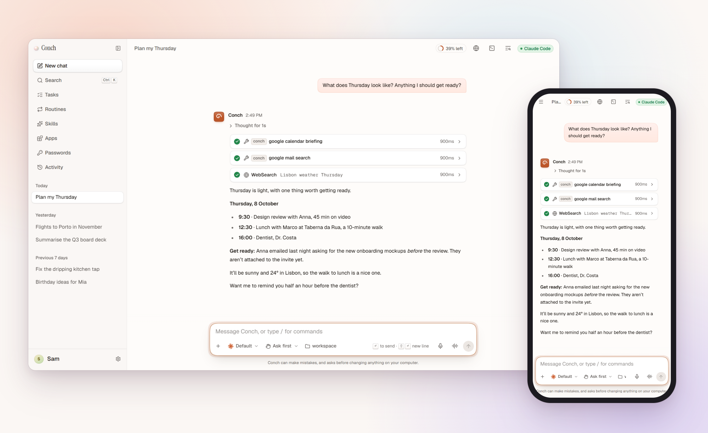

<p align="center">
  <picture>
    <source media="(prefers-color-scheme: dark)" srcset=".github/assets/pearl-dark.svg">
    
  </picture>
</p>

<h1 align="center">Conch</h1>

<p align="center">
  <b>The AI agent that just works. Let it solve your problems.</b>
</p>

<p align="center">
  Use the AI subscriptions and API keys you already have.<br>
  Conch sets itself up, fixes what breaks, and asks you only when it has to.
</p>

<p align="center">
  <a href="https://github.com/georgevibing/conch-agent/actions/workflows/ci.yml"></a>
  <a href="./LICENSE"></a>
  
  
</p>

<p align="center">
  <a href="#install"><b>Install</b></a>
  &nbsp;·&nbsp;
  <a href="#what-it-does"><b>What it does</b></a>
  &nbsp;·&nbsp;
  <a href="./apps/docs/content/start/first-chat.md"><b>Your first chat</b></a>
  &nbsp;·&nbsp;
  <a href="./apps/docs/content"><b>Documentation</b></a>
  &nbsp;·&nbsp;
  <a href="./CONTRIBUTING.md"><b>Contributing</b></a>
</p>

<br>

<p align="center">
  <picture>
    <source media="(prefers-color-scheme: dark)" srcset=".github/assets/showcase-dark.png">
    
  </picture>
</p>

## Why Conch

- **It just works.** Download it and open it. Conch installs what it needs, and
  there's no account to make. Made for people who never open a terminal.
- **It fixes itself.** What breaks, it mends on its own. When something needs
  you, like signing in again, you get one plain sentence and the button that does it.
- **The AI you already pay for.** Sign in with your subscriptions or paste an API
  key, and every model is in one picker. A chat can move between them without
  losing its thread.
- **Yours, on your computer.** Chats, memories and settings are plain files in
  `~/.conch`. There's no Conch account and no telemetry.

## What it does

### 💬 Talk to any model

- **Every provider at once.** Coding agents with their own tools (Claude Code and
  Codex CLI, asking through Conch); Codex, GitHub Copilot, Gemini CLI and Grok
  through their own sign-in; Ollama, LM Studio or a server of your own; keys
  from OpenRouter, Anthropic, OpenAI, Google, Mistral, DeepSeek and more.
- **Long chats on any model.** When a chat outgrows what a model reads at once,
  its start becomes a summary you can open, and what you said there is learned first.
- **Questions you answer with a tap.** When the assistant needs your choice, it
  asks with options, days or a number to tap, and the reply carries on.
- **Offline and at a limit.** A message waits until you're back, or the model on
  this computer answers. At a usage limit, the provider you picked takes over.
- **What it costs, in plain sight.** Each reply and each chat says what it cost,
  or how much of your plan it used. Set a limit for a chat or the month, and a
  chat asks before spending more.

### 🧩 Get things done

- **Apps and skills for every model.** Gmail, Google Calendar and Drive, Slack,
  GitHub, Notion, Linear and more from one gallery, plus Agent Skills (`SKILL.md`).
  When one that isn't on would help, the chat offers it, and carries on once it's on.
  What they find shows as it is: a calendar as days, emails, files and messages.
- **Apps it makes for you.** Say what you want ("remember when I water my plants"),
  and Conch builds an app: tools every model can use, a page that looks like Conch,
  sealed off from your files and the web. It's added when you press the button, shared
  on GitHub or as a file in one press, and apps others shared are one link away.
- **Routines that start Every… or When…** Every weekday at 7:30, or when an email arrives,
  before a meeting, when a page changes. Watching is free until something happens,
  each routine says what it costs, and a monthly limit keeps them from running up a bill.
- **A browser and a terminal.** The assistant uses a browser you can watch and
  take over: tabs, uploads, dragging, even a canvas. It can run in your own Chrome
  or in the cloud, and a real shell is a keystroke away.
- **Show me.** Charts, pages and documents open beside the chat, with every version kept.
- **Hand it off.** Send work to the background and keep chatting, or have another
  provider do a part ("have Codex write the tests").

### 🧠 It learns you

- **Memory you can read.** Memories are Markdown files you can edit or forget.
  Search finds any line in months of chats, and "like last time" finds the chat it means.
- **Skills from what worked.** After the assistant works something hard out, one
  press keeps how it did it as a skill. Nothing is saved or turned on until you say so.
  Or describe one in a sentence, and it writes the steps for you to read and change.

### 📱 Wherever you are

- **Your chat apps.** Telegram, Discord, Slack, WhatsApp, Signal, iMessage, email,
  Microsoft Teams, Google Chat, Matrix, WeChat, LINE, Mattermost, Rocket.Chat, and plain text
  messages to a number of its own. In a group you turn on, it answers when
  mentioned: you as in private, everyone else in words only. Voice notes are
  heard on your own computer.
- **Your phone.** An installable app over a private Tailscale address, with
  notifications and voice.
- **Your own address.** On a server, Conch answers at `conch.yourname.com` with
  its own certificate. One line installs it; a link opened on your laptop makes it
  yours.
- **Touch ID, Windows Hello, Face ID.** Sign in with what your device already has.
  New devices wait for your OK, which you give from one you already use.
- **Your desktop.** Conch for macOS, Windows and Linux: its own window, the pearl
  in the menu bar, and each new release one press away. Say “Hey Conch” to talk, if
  you turn it on; it listens on your computer only.
- **Your other apps.** Claude Desktop, Cursor and VS Code can use your memory,
  skills, apps and Conch's browser, connected in one press, each only what you tick.

### 🛡️ Safe hands, and it looks after itself

- **Asks before anything risky.** After a chat reads a web page or an email,
  anything risky asks first. Commands run sealed off from your keys.
- **See it, undo it.** **Activity** shows everything the assistant did, finds any
  of it as you type, and **Undo** puts back the files it changed.
- **Repair everything.** One button checks every part of Conch and fixes what it
  can. Daily backups, and signed updates that go back if something fails.

### 🏡 Make yourself at home

- **Bring your things.** Memories, skills and routines from OpenClaw or Hermes,
  shown to you first and undoable for a week.
- **One box for everything.** <kbd>⌘</kbd>/<kbd>Ctrl</kbd> + <kbd>K</kbd> finds
  chats, models, skills, apps and settings by name.

There's much more, from archiving chats to passwords and attachments. The
[documentation](./apps/docs/content) covers every feature, provider and chat app.

## Install

**Download the app** for macOS, Windows or Linux from the
[latest release](https://github.com/georgevibing/conch-agent/releases/latest) and
open it. It carries everything it needs. If your computer asks before opening it
the first time, [the guide](./apps/docs/content/start/app.md#if-your-computer-asks-first)
says which button to press.

Or one line in a terminal, on macOS and Linux:

```bash
curl -fsSL https://raw.githubusercontent.com/georgevibing/conch-agent/main/scripts/install.sh | sh
```

On Windows (PowerShell):

```powershell
irm https://raw.githubusercontent.com/georgevibing/conch-agent/main/scripts/install.ps1 | iex
```

The installer gets Node.js and Git if they're missing, builds Conch, keeps it
running in the background and opens it. Conch then helps you connect a provider.
Run the same line again to update. Add `--uninstall` to remove it.

**On a server** (or any computer with no screen), add `--server`. Over SSH it does
this by itself. It asks how you'll reach Conch: at an address of your own, through a
tunnel or web server you already run (Cloudflare Tunnel, nginx, Caddy), privately with
Tailscale, or only from that computer. For an address, it shows the DNS record to add,
gets the certificate, and ends with a link you open on your own computer to make Conch
yours. [On a server](./apps/docs/content/start/server.md) walks through it.

The installer also adds `conch` to your terminal: `conch help` lists what it can do.

From a checkout (Node 24 or newer):

```bash
corepack enable
pnpm install
pnpm start        # builds and opens http://localhost:4317
```

> [!IMPORTANT]
> **Conch runs as you.** It can read your files and run commands, so treat it like
> an SSH server. Out of the box only this computer can open it, in a browser Conch opened itself. Read
> [docs/SECURITY.md](./docs/SECURITY.md) before you put it on a network.

**On your phone:** in **Settings → Security**, press **Add a device** and scan the
QR code. Conch sets up the private address for you.

## Questions

<details>
<summary><b>What does it cost?</b></summary>

Conch is free and open source. The models are whatever you connect: a plan you
already pay for, a key you pay per use, or a model on your own computer, which
costs nothing.

</details>

<details>
<summary><b>Where do my chats go?</b></summary>

They're kept on your computer, in `~/.conch`. What you send a model goes to the
provider you chose for that chat, and a model on this computer keeps everything on
this computer. Conch has no server of its own and sends no telemetry.

</details>

<details>
<summary><b>Do I need to know how to use a terminal?</b></summary>

No. Download the app and open it. Conch installs what a feature needs, offers the
one button that finishes a setup, and says in plain words when only you can do
something, like signing in.

</details>

<details>
<summary><b>Is it safe to let an assistant work on my computer?</b></summary>

It runs as you, so it's built to be careful: risky actions ask first, especially
after a chat has read something from outside; commands can't reach your keys;
everything it did is in **Activity**; and **Undo** puts files back.
[docs/SECURITY.md](./docs/SECURITY.md) has the details.

</details>

<details>
<summary><b>I use OpenClaw or Hermes. Can I bring my things?</b></summary>

Yes. Conch finds them and shows you everything first: your memories, skills,
routines, chat bots and model choice. Bring what you tick, and Undo takes it back
for a week. It's in **Settings → Memory**, or `pnpm conch import`.

</details>

## Documentation

`pnpm docs:dev` serves the site at http://localhost:4400: guides for every
provider, chat app and feature, plus a reference for the command line,
configuration and API that's read from the code. The sources:

- [apps/docs/content](./apps/docs/content): the guides
- [ARCHITECTURE.md](./ARCHITECTURE.md): how it's built, and the security model
- [docs/SECURITY.md](./docs/SECURITY.md): signing in, phones, recovery
- [docs/adr](./docs/adr): why things are the way they are
- [AGENTS.md](./AGENTS.md): how to work in this repo, for people and coding agents

## Development

```bash
pnpm dev          # web app on :5173 (hot reload) + gateway on :4317
pnpm dev:mock     # the same with a scripted provider and pretend apps: no model usage
pnpm storybook    # the Nacre design system on :6006
pnpm check        # format, lint, types and tests: must pass before every commit
pnpm e2e          # Playwright journeys against the gateway and the mock provider
pnpm desktop:dev  # the desktop app on the repository, with hot reload
pnpm conch help   # the command line (conch, once installed): setup, status, devices …
```

Configuration comes from the environment;
[apps/server/.env.example](./apps/server/.env.example) lists it.

| Path                | What                                                                     |
| ------------------- | ------------------------------------------------------------------------ |
| `apps/web`          | React 19 + Vite web app                                                  |
| `apps/server`       | Fastify gateway: providers, integrations, browser, terminal, channels, … |
| `apps/docs`         | The documentation site                                                   |
| `apps/desktop`      | The Electron app for macOS, Windows and Linux                            |
| `packages/nacre`    | Nacre, Conch's design system, with Storybook                             |
| `packages/protocol` | Zod schemas for every message between the app and the gateway            |
| `e2e`               | Playwright journeys                                                      |

## Contributing

Issues and pull requests are welcome. Start with [CONTRIBUTING.md](./CONTRIBUTING.md),
and please follow the [code of conduct](./CODE_OF_CONDUCT.md). To report a
vulnerability, see [SECURITY.md](./SECURITY.md) rather than opening an issue.

## License

[MIT](./LICENSE). Third-party notices are in [NOTICE.md](./NOTICE.md).

<br>

<p align="center">
  <picture>
    <source media="(prefers-color-scheme: dark)" srcset=".github/assets/pearl-dark.svg">
    
  </picture>
</p>
