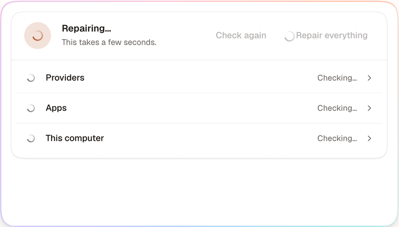

<p align="center">
  <picture>
    <source media="(prefers-color-scheme: dark)" srcset=".github/assets/pearl-dark.svg">
    
  </picture>
</p>

<h1 align="center">Conch</h1>

<p align="center">
  <b>The AI assistant that just works. Let it solve your problems.</b>
</p>

<p align="center">
  Every model you pay for, in one calm app on your own computer.<br>
  It sets itself up, fixes what breaks, and asks you only when it matters.
</p>

<p align="center">
  <a href="https://github.com/georgevibing/conch-agent/actions/workflows/ci.yml"></a>
  <a href="https://github.com/georgevibing/conch-agent/actions/workflows/codeql.yml"></a>
  <a href="https://scorecard.dev/viewer/?uri=github.com/georgevibing/conch-agent"></a>
  <a href="https://github.com/georgevibing/conch-agent/releases"></a>
  <a href="./LICENSE"></a>
  <br>
  
  
</p>

<p align="center">
  <a href="#install"><b>Install</b></a>
  &nbsp;·&nbsp;
  <a href="#three-things-it-does-differently"><b>Why Conch</b></a>
  &nbsp;·&nbsp;
  <a href="#what-it-does"><b>What it does</b></a>
  &nbsp;·&nbsp;
  <a href="https://conchagent.com/docs/"><b>Docs</b></a>
  &nbsp;·&nbsp;
  <a href="./CONTRIBUTING.md"><b>Contributing</b></a>
</p>

<br>

<p align="center">
  <picture>
    <source media="(prefers-color-scheme: dark)" srcset=".github/assets/showcase-dark.png">
    
  </picture>
</p>

Download it, open it, sign in with a plan you already pay for or paste a key. That is
the setup. There is no account to make, no terminal to learn and no telemetry. Your
chats, memories and settings live in `~/.conch` on your computer, and one assistant
reaches you on the web, your phone, your desktop and the chat apps you already use.

Conch is for anyone. If you have never opened a terminal, it still works for you. If
you live in one, it brings every coding agent you have into one place.

## Install

**The app.** Download it for macOS, Windows or Linux from the
[latest release](https://github.com/georgevibing/conch-agent/releases/latest) and
open it. If your computer asks first, [the guide](./apps/docs/content/start/app.md#if-your-computer-asks-first)
says which button to press.

**One line.** On macOS and Linux:

```bash
curl -fsSL https://conchagent.com/install.sh | sh
```

On Windows, in PowerShell:

```powershell
irm https://conchagent.com/install.ps1 | iex
```

It fetches Node.js and Git if they are missing, keeps Conch running and opens it. Run
the same line again to update. Add `--server` on a computer with no screen, or
`--uninstall` to remove it. Afterwards, `conch help` lists what the command line can do.

**From a checkout**, with Node 24 or newer:

```bash
corepack enable
pnpm install
pnpm start        # builds and opens http://localhost:4317
```

## Three things it does differently

### It knows what it can do. Just ask.

Ask about Friday before your calendar is connected, and Conch does not guess. The
card that connects it is right under the reply. Press it, and the chat carries on by
itself with the day as it is. Every app, skill and setting works this way: nothing to
configure first, no file to edit, and nothing is turned on until you say so. That is
how someone who has never opened a terminal gets the same assistant as someone who
lives in one.

<p align="center">
  <picture>
    <source media="(prefers-color-scheme: dark)" srcset=".github/assets/knows-dark.gif">
    
  </picture>
</p>

### Ask for an app. It builds one.

When nothing you have does what you need, say so in your own words. Conch writes a
Conch app, checks it, tries every part of it and shows it to you as a card. Its tools
work with every model, its pages look like Conch, and it runs sealed off from your
files. Nothing is added until you press the button, and you can share it on GitHub in
one press. The same goes for a provider or a chat app Conch does not list yet: name
it, and Conch reads the docs and makes it.

<p align="center">
  <picture>
    <source media="(prefers-color-scheme: dark)" srcset=".github/assets/make-apps-dark.gif">
    
  </picture>
</p>

### Something broke? It is already fixed.

Conch keeps an eye on every part of itself and mends what it can before you notice: a
program that is missing, a process left behind by a crash, an app whose sign-in needed
refreshing. What it fixed while you were away is a quiet list, not an alarm. When
something needs you, like signing in again, you get one plain sentence and the button
that does it. Daily backups and signed updates that roll back on failure come with it.

<p align="center">
  <picture>
    <source media="(prefers-color-scheme: dark)" srcset=".github/assets/repair-dark.gif">
    
  </picture>
</p>

## What it does

<table>
<tr>
<td width="50%" valign="top">

**In the chat**

- **Every model you have, one picker.** The plans you already pay for, with their own
  sign-in: Claude Code, Codex, GitHub Copilot, Gemini CLI, Grok. Keys from OpenRouter,
  Anthropic, OpenAI, Google, Mistral, DeepSeek and more. Ollama or LM Studio for a
  model that is private and offline. A chat can switch models without losing its
  thread, and when a plan hits its limit or the internet goes, the next one carries
  on. [Providers](./apps/docs/content/providers)
- **It says what it is doing, in plain words.** Each run of work is one line, like
  "Ran the tests · 241 passed", that opens into its steps. Ask **Why?** about any of
  them. [Your chats](./apps/docs/content/features/chats.md)
- **It does not give up at the first error.** Every model reads what went wrong, tries
  another way and checks its work before it says done.
  [Working on a problem](./apps/docs/content/features/working-on-a-problem.md)
- **It waits without nagging.** "Watch CI and fix it if it fails." The chat stays
  yours, and your assistant carries on when something changes.
- **Big jobs in one go.** For 300 emails or 40 pages it writes one short script,
  sealed off, shown as one line with live counts and one Undo.
  [Scripts](./apps/docs/content/features/scripts.md)
- **Cards you can press.** Calendars, emails, files, products, songs, places, prices
  and charts, each a card in the chat. [Cards](./apps/docs/content/features/cards.md)
- **Research, files and pictures.** Sources with references, PDF and Office files read
  and made, and charts and documents that open beside the chat.
  [Show me](./apps/docs/content/features/show-me.md)
- **See how it did it.** Replay any chat step by step, and save it as a page or as
  training files with keys and personal details taken out.
  [How it did it](./apps/docs/content/features/how-it-did-it.md)

</td>
<td width="50%" valign="top">

**Your agents**

- **As many as you like.** Each with a name, a face, a personality and instructions.
  Pick who answers a chat, or set one per chat app and routine.
  [Agents](./apps/docs/content/features/agents.md)
- **They talk to each other.** "@Researcher find options, @Writer draft it." Agents
  take turns in one chat and stop before they loop or run up a bill.
- **Work in the background.** Hand a job off and keep chatting, or have another
  provider do a part. [Tasks](./apps/docs/content/features/tasks.md)
- **Memory that looks after itself.** Plain Markdown you can read, edit or forget,
  tidied overnight and reported in a short morning note.
  [Memory](./apps/docs/content/features/memory.md)
- **Skills** for every model, from what worked, from a sentence or from **Discover**.
  [Skills](./apps/docs/content/features/skills.md)
- **Bring your things.** Memories, skills, routines and agents from OpenClaw or
  Hermes, and past chats from Claude Code, Codex, Gemini CLI, OpenCode and Copilot.
  [Come home](./apps/docs/content/care/come-home.md)

</td>
</tr>
<tr>
<td width="50%" valign="top">

**Works for you**

- **Routines.** Every weekday at 7:30, when an email arrives, before a meeting, when a
  page changes. [Routines](./apps/docs/content/features/routines.md)
- **Standing orders.** Say once "always tell me if a flight changes". Conch looks now
  and then, for free until something is new. [Check-ins](./apps/docs/content/features/check-ins.md)
- **A browser you can watch** and take over, and a real terminal a keystroke away.
  [Browser](./apps/docs/content/features/browser.md) ·
  [Terminal](./apps/docs/content/features/terminal.md)
- **Your apps, while you watch.** On a Mac it can click and type in the apps you
  allow, one at a time, with Stop one press away.
  [Use your apps](./apps/docs/content/features/use-your-apps.md)
- **One gallery for every model.** Gmail, Google Calendar and Drive, Slack, GitHub,
  Notion, Linear and more. Choose Off, Read or Read & write for each.
  [Apps](./apps/docs/content/features/apps.md)
- **Your other tools.** Claude Desktop, Cursor and VS Code can use your memory,
  skills, apps and browser. [Other apps](./apps/docs/content/features/other-apps.md)

</td>
<td width="50%" valign="top">

**Everywhere, and safe**

- **Web, desktop, phone.** An app for macOS, Windows and Linux with the pearl in the
  menu bar, and an installable app on your phone over a private address.
  [On your phone](./apps/docs/content/start/phone.md)
- **Your chat apps.** Telegram, Discord, Slack, WhatsApp, Signal, iMessage, email,
  Teams, Matrix and more, with the same commands.
  [Chat apps](./apps/docs/content/channels)
- **A server of your own.** One line installs it at `conch.yourname.com` with its own
  certificate. [On a server](./apps/docs/content/start/server.md)
- **Four permission modes,** the same on every provider: Read only, Ask first, Auto
  and Full trust. [Modes](./apps/docs/content/reference/modes.md)
- **Careful after reading.** Once a chat has read a web page or an email, anything
  risky asks first. Commands run sealed off from your keys.
- **Choose where work runs.** This computer, a locked-down container, a machine over
  SSH or a sandbox in the cloud.
  [Where work runs](./apps/docs/content/features/where-work-runs.md)
- **See it, undo it.** **Activity** shows everything it did. **Undo** puts files back.
  [Undo](./apps/docs/content/care/undo.md)
- **Sign in with your device.** Touch ID, Windows Hello or Face ID. A new device waits
  for your OK. [Signing in](./apps/docs/content/security/signing-in.md)

</td>
</tr>
</table>

## How it works

| Wherever you are                                       | Conch, on your computer                                                                               | Your providers                                                              |
| ------------------------------------------------------ | ----------------------------------------------------------------------------------------------------- | --------------------------------------------------------------------------- |
| A browser on this computer, your phone, or a chat app. | Keeps your chats, memory, skills, apps and routines in `~/.conch`. Asks before anything that matters. | The assistants and models you connect. All of them answer, from one picker. |

A small Node gateway on your machine drives every provider you connected and streams
the conversation to a React app built on [Nacre](./packages/nacre), Conch's own
design system. Apps and skills belong to Conch, not to a provider, so they work with
every model. Conch keeps no copy of anything anywhere else.

## Good to know

- **It runs as you.** Conch can read your files and run commands. Treat it like an SSH
  server and read [docs/SECURITY.md](./docs/SECURITY.md) before you put it on a
  network. Out of the box, only this computer can open it.
- **Local models are smaller.** A model on your computer is free and private, but
  slower and less capable than the cloud ones.
- **Conch is free.** The models cost what your plan or key costs, and each reply says
  what it cost. [What it costs](./apps/docs/content/care/what-it-costs.md)

## Documentation and development

[conchagent.com/docs](https://conchagent.com/docs/) covers every provider, chat app
and feature, with a reference read from the code. [Development docs](https://conchagent.com/docs/next/)
follow `main`, and [release notes](https://conchagent.com/releases/) list every
version. How it is built: [ARCHITECTURE.md](./ARCHITECTURE.md) ·
[decisions](./docs/adr) · [AGENTS.md](./AGENTS.md), the manual for people and coding
agents alike.

```bash
pnpm dev          # web app on :5173 (hot reload) + gateway on :4317
pnpm dev:mock     # the same with a scripted provider: no model usage
pnpm storybook    # the Nacre design system on :6006
pnpm docs:dev     # the documentation on :4400
pnpm check        # format, lint, types and tests: must pass before every commit
pnpm e2e          # Playwright journeys
pnpm desktop:dev  # the desktop app, with hot reload
```

| Path                | What                                                       |
| ------------------- | ---------------------------------------------------------- |
| `apps/web`          | React 19 + Vite web app                                    |
| `apps/server`       | Fastify gateway: providers, apps, browser, terminal, chats |
| `apps/docs`         | The documentation site                                     |
| `apps/desktop`      | The Electron app                                           |
| `packages/nacre`    | Nacre, Conch's design system                               |
| `packages/protocol` | Zod schemas for everything the app and gateway say         |
| `e2e`               | Playwright journeys                                        |

Configuration comes from the environment: [apps/server/.env.example](./apps/server/.env.example).

## Contributing, security, license

Issues and pull requests are welcome: start with [CONTRIBUTING.md](./CONTRIBUTING.md)
and the [code of conduct](./CODE_OF_CONDUCT.md). Report a vulnerability through
[SECURITY.md](./SECURITY.md), not an issue. [MIT](./LICENSE) licensed; third-party
notices in [NOTICE.md](./NOTICE.md).

<br>

<p align="center">
  <picture>
    <source media="(prefers-color-scheme: dark)" srcset=".github/assets/pearl-dark.svg">
    
  </picture>
  <br>
  <sub>In the old story, whoever holds the conch gets to speak.</sub>
</p>
